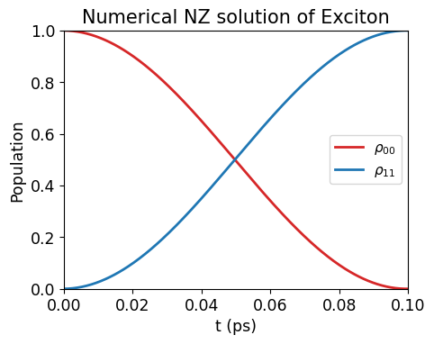
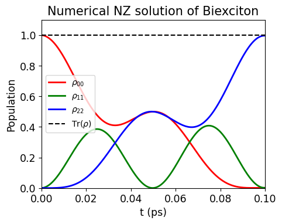
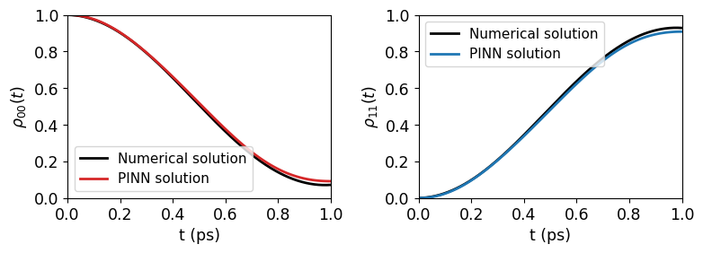
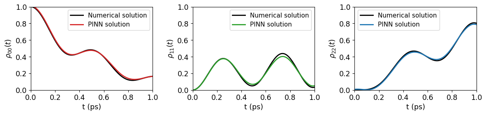
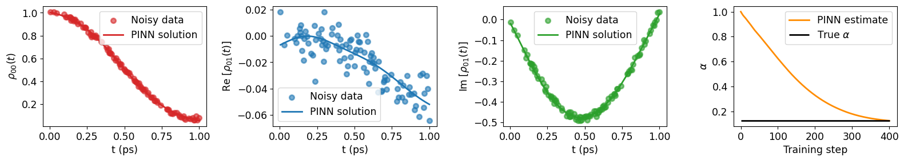
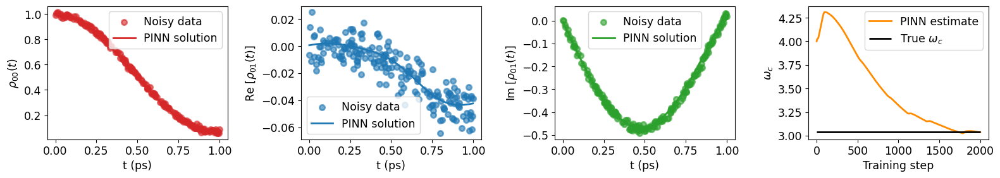
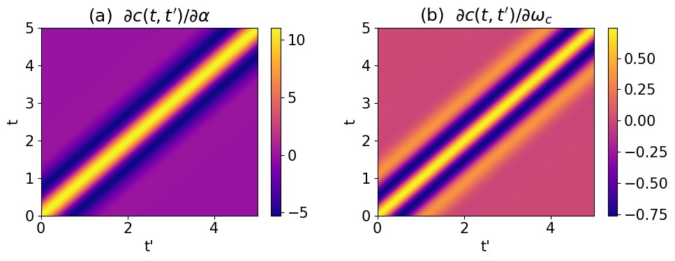

# PINN‑NZ: Physics‑Informed Neural Networks for the Nakajima–Zwanzig Equation

A reproducible PyTorch implementation of **Physics‑Informed Neural Networks (PINNs)** for *learning* and *inverting* the **Nakajima–Zwanzig (NZ)** non‑Markovian master equation governing the reduced density matrix dynamics of a semiconductor quantum‑dot biexciton system strongly coupled to an acoustic‑phonon environment.
This repository accompanies the manuscript *“Learning and inverting driven open quantum systems via physics-informed neural networks”* and includes scripts, notebook demonstrations, and figures.


## 🚀 Overview
This project demonstrates 
- **Non‑Markovian Dynamics:** Numerical solution of the integro‑differential NZ equation for coupled exciton and biexciton systems to acoustic-phonon bath.
- **Forward Simulation using PINN:**
Approximate the reduced density matrix $\rho (t)$ of an exciton/biexciton quantum dot system using the knowledge of the NZ equation and initial conditions.
- **Synthetic noisy data generation** - Introducing noise on top of numerically simulated density matrices.
- **Inverse Parameter Estimation:** Predict the bath parameters such as coupling strength ($\alpha$) or cutoff frequency ($\omega_c$) from the noisy observations
- **Sensitivity Analysis:** How are the bath parameters sensitive to evolution trajectories and their contribution to the ill-posedness of the inverse problem.


## 📘 Physical Model

### NZ Equation:
$\dot {\rho }(t)=-i[\hat {H}_S(t),\rho (t)]+\int _0^t\hat {K}(t,t')\rho (t')dt'$

where,

* $\hat{\mathcal{K}}(t,t') \rho(t') = i[\hat{S}, \{i c(t,t')\hat{U}(t,t')\hat{S}\rho(t')\} + \{H.c.\}]$

    *  time-ordered unitary propagator : $\hat{U} = \mathcal{T} e^{-i\int_{t'}^t\hat{H}_S dt''}$

    *   correlation function : $c(t,t') = \int_{-\infty}^{+\infty} n_\beta (\omega) J(\omega) e^{i \omega (t-t')}d\omega$

        *   phonon occupation number : $n_\beta(\omega) = 1/(e^{\beta\omega} -1)$

        *   inverse temperature : $\beta = \hbar/k_B T$

        *   spectral density function : $J(\omega) = 2\alpha (\omega^3/\omega_c^2) e^{-\omega^2/\omega_c^2}$


## Exciton
- System: Two-level biexciton quantum dot with states $|0 \rangle ,|1 \rangle$.
- Hamiltonian:
$\hat {H}_S=\hbar/2\left( \begin{matrix}\Delta &-\Omega \\ -\Omega &-\Delta \end{matrix}\right) $

- Coupling Matrix:
$\hat {S}=\left( \begin{matrix}0&0\\ 0&1\end{matrix}\right)$


## Biexciton
- System: Three‑level biexciton quantum dot with states $|0 \rangle ,|1 \rangle,|2 \rangle $.
- Hamiltonian:
$\hat {H}_S=\hbar\left( \begin{matrix}\Delta &-\Omega /2&0\\ -\Omega /2&-E_b/2\hbar&-\Omega /2\\ 0&-\Omega /2&-\Delta \end{matrix}\right) $

- Coupling Matrix:
$\hat {S}=\left( \begin{matrix}0&0&0\\ 0&1&0\\ 0&0&2\end{matrix}\right)$


## 🧠 PINN Architecture

The exciton and biexciton model are designed differently. The general idea is that the neural network takes time instance $t$ as the input and output elements of the density matrix of the system. For the exciton model 3 outputs suffices while for the biexciton model 8 outputs are required as mentioned below.

*   **Input:** $t \in ℝ$

*   **Output:** 
    *   $\mathcal{NN}_{ex}(\textbf{w}, t) =  \bigg[ \rho_{00}^{\text{ex}}(t_i), ~ Re[\rho_{01}^{\text{ex}}(t_i)], ~ Im[\rho_{01}^{\text{ex}}(t_i)]\bigg]  \in ℝ^3$

    *   $\mathcal{NN}_{biex}(\textbf{w}, t) = \bigg[ \rho_{00}^{\text{biex}}(t_i), ~ \rho_{11}^{\text{biex}}(t_i), ~ Re[\rho_{01}^{\text{biex}}(t_i)],  ~ Im[\rho_{01}^{\text{biex}}(t_i)], ~ Re[\rho_{02}^{\text{biex}}(t_i)], ~ Im[\rho_{02}^{\text{biex}}(t_i)], ~ Re[\rho_{12}^{\text{biex}}(t_i)], ~ Im[\rho_{12}^{\text{biex}}(t_i)] \bigg] ~ \in  ℝ^8$

The complete density matrix for the exciton is constructed as follows

*   $\rho_{01} = Re[\rho_{01}] + Im[\rho_{01}]$

*   $\rho_{10} = \rho_{01}^*$

*   $\rho_{11} = 1 - \rho_{00}$

*   $\rho = \left[\begin{matrix} \rho_{00} & \rho_{01} \\ \rho_{10} & \rho_{11} \end{matrix} \right]$

while for the biexciton,

*   $\rho_{01} = Re[\rho_{01}] + Im[\rho_{01}]$

*   $\rho_{02} = Re[\rho_{02}] + Im[\rho_{02}]$

*   $\rho_{12} = Re[\rho_{12}] + Im[\rho_{12}]$

*   $\rho_{10} = \rho_{01}^*$

*   $\rho_{20} = \rho_{02}^*$

*   $\rho_{21} = \rho_{12}^*$

*   $\rho_{22} = 1 - \rho_{00} - \rho_{11}$

*   $\rho = \left[\begin{matrix} \rho_{00}& \rho_{01} & \rho_{02} \\ \rho_{10} & \rho_{11} & \rho_{12} \\ \rho_{20} & \rho_{21} & \rho_{22} \end{matrix} \right]$


Using ```torch.autograd.grad()``` function we can calculate the gradient of the density matrix. But the real and imaginary parts need to be adressed separately and then combined again as before.


## 📂 Repository Structure
```bash
pinn_nz/
│
├── .gitignore
├── data/                # Numerical solvers, Noisy data generator
├── figures/             # Plots and results
├── estimator.py         # PINN Inverse estimation
├── train.py             # Training script
├── sensitivity.py       # Sensitivity analysis
├── visualizations.py    # Plotting utilities
├── notebook.ipynb       # End-to-end demonstration
└── README.md            # Project description
```


## 🛠️ Installation
```bash
git clone https://github.com/Sutirtha-github/pinn_nz

py -m venv venv 
# Windows (Powershell)
.\venv\Scripts\Activate.ps1

pip install -r requirements.txt
```


## ▶️ Running the Experiments

This notebook provides an interactive, end‑to‑end demonstration of running the PINN training for exciton/biexciton models.
```bash
notebook.ipynb
```

## 📊 Results
The repository includes:
- Numerical simulation of exciton and biexciton system
 


- PINN training (forward simulation)



- PINN estimation (inverse learning)


- Sensitivity analysis of bath parameters

- Figures stored in figures/


## 🧪 Reproducibility

- Fixed random seeds
- Deterministic PyTorch settings
- Version‑locked dependencies

## 📄 Citation

If you use this code in your research, please cite the associated manuscript:
```
@article{Biswas_2026,
doi = {10.1088/2632-2153/ae4b84},
url = {https://doi.org/10.1088/2632-2153/ae4b84},
year = {2026},
month = {mar},
publisher = {IOP Publishing},
volume = {7},
number = {2},
pages = {025022},
author = {Biswas, Sutirtha and Paspalakis, Emmanuel},
title = {Learning and inverting driven open quantum systems via physics-informed neural networks},
journal = {Machine Learning: Science and Technology}
}
```


## 🤝 Contributions
Pull requests, issues, and discussions are welcome.
For major changes, please open an issue first.

## 📬 Contact

For questions or collaborations, feel free to reach out via GitHub Issues or the following emails.

*   Sutirtha Biswas: [sutibisw@ee.duth.gr](mailto:sutibisw@ee.duth.gr)
*   Emmanuel Paspalakis: [paspalak@upatras.gr](mailto:paspalak@upatras.gr)
